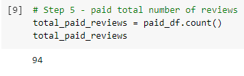
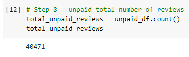
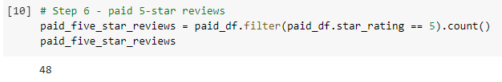
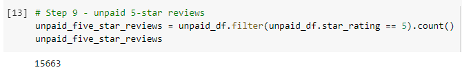
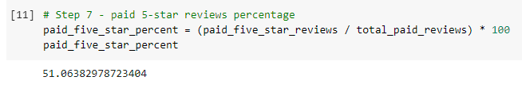
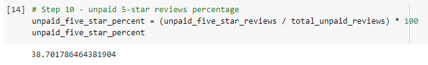

# Amazon_Vine_Analysis
Perform ETL on Amazon Product Reviews, determine Bias of Vine Reviews
This project analyzes Amazon Vine program and determines if there is a bias toward favorable reviews from Vine members.
The analysis uses PySpark to perform the ETL process to extract the dataset, transform the data, connect to an AWS RDS instance, load the transformed data into pgAdmin and calculate different metrics.
We focused on the US reviews for video games.
We used Google Colab to write both IPYNB files: "Amazon_Reviews_ETL" (that creates the 4 tables on pgAdmin), and "

## Resources

Data Source: Amazon Review datasets (https://s3.amazonaws.com/amazon-reviews-pds/tsv/index.txt). I selected for this project the: Video Games Review dataset (https://s3.amazonaws.com/amazon-reviews-pds/tsv/amazon_reviews_us_Video_Games_v1_00.tsv.gz)

Software: Google Colab Notebook (https://colab.research.google.com/), PySpark (embeded on Google Colab), pgAdmin4 (http://127.0.0.1:60698/browser/), AWS (https://aws.amazon.com/)

## Created 4 tables on pgAdmin4

Also, exported table "VINE_TABLE" to a csv file called VINE_TABLE.CSV

Customers_table (customers_df):

Products_table (products_df)

Review_id_table (review_id_df)

Vine_table (vine_df)

## Results
### Total number of reviews

- Vine reviews: 94 count:

- Non-Vine reviews: 40,471 count:

  
### Total number of 5-star reviews

*5-star Vine reviews: 48 count:

*5-star Non-Vine reviews: 15,663 count:

### Percentage of 5-star reviews

*Percentage of 5-star Vine reviews: 51.06% percent:

*Percentage of 5-star Non-Vine reviews: 38.70% percent:

## Summary
51% of the reviews in the Vine program were 5 stars reviews whereas the percentage in the non-Vine reviews is only 39%. This describes a positivity bias for reviews in the Vine program.
Additionally we could analyse the statistical distribution (mean, median and mode) of the star rating for the Vine and non-Vine reviews.
